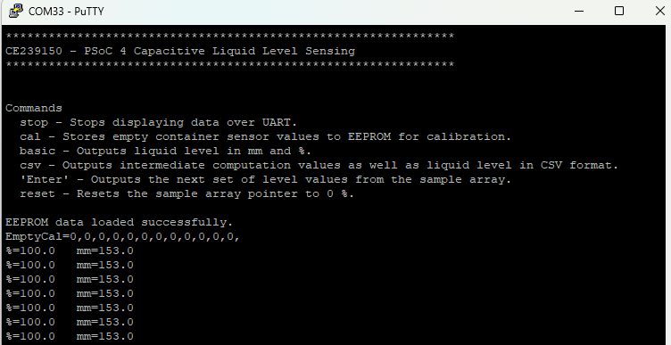

# PSoC&trade; 4: CAPSENSE&trade; liquid-level sensing

This code example demonstrates how to use PSoC&trade; 4 MCU, CAPSENSE&trade; technology, and capacitive sensors to measure the depth or presence of water-based liquids in non-conductive containers. Sensors located on or near the containers exterior provide real-time reporting of liquid levels. There are multiple options available that use low-cost materials to construct and integrate the sensors, while continuing to provide high-precision measurements.

The firmware continuously measures the data from the 12-sensor (12 Rx) patterns using the CY8CKIT-022 CAPSENSE&trade; liquid-level sensing shield and outputs the calculated liquid level over both the serial UART connections. The project supports water-based liquids using CAPSENSE&trade; self capacitance.

[View this README on GitHub.](https://github.com/Infineon/mtb-example-psoc4-capsense-liquid-level-sensing)

[Provide feedback on this code example.](https://yourvoice.infineon.com/jfe/form/SV_1NTns53sK2yiljn?Q_EED=eyJVbmlxdWUgRG9jIElkIjoiQ0UyMzkxNTAiLCJTcGVjIE51bWJlciI6IjAwMi0zOTE1MCIsIkRvYyBUaXRsZSI6IlBTb0MmdHJhZGU7IDQ6IENBUFNFTlNFJnRyYWRlOyBsaXF1aWQtbGV2ZWwgc2Vuc2luZyIsInJpZCI6InNhbmRlZXAuYWtAaW5maW5lb24uY29tIiwiRG9jIHZlcnNpb24iOiIyLjAuMCIsIkRvYyBMYW5ndWFnZSI6IkVuZ2xpc2giLCJEb2MgRGl2aXNpb24iOiJNQ0QiLCJEb2MgQlUiOiJJQ1ciLCJEb2MgRmFtaWx5IjoiUFNPQyJ9)


## Requirements

- [ModusToolbox&trade;](https://www.infineon.com/modustoolbox) v3.7 or later (tested with v3.7)
- [ModusToolbox&trade; CAPSENSE&trade; and Multi-Sense Pack](https://softwaretools.infineon.com/tools/com.ifx.tb.tool.modustoolboxpackmultisense) for [ModusToolbox&trade;](https://www.infineon.com/modustoolbox) v3.7 or later
- Board support package (BSP) minimum required version: 3.1.0
- Programming language: C
- Associated parts: [PSoC&trade; 4100S Max](https://www.infineon.com/cms/en/product/microcontroller/32-bit-psoc-arm-cortex-microcontroller/psoc-4-32-bit-arm-cortex-m0-mcu/), [PSoC&trade; 4500S](https://www.infineon.com/cms/en/product/microcontroller/32-bit-psoc-arm-cortex-microcontroller/psoc-4-32-bit-arm-cortex-m0-mcu/)

## Supported toolchains (make variable 'TOOLCHAIN')

- GNU Arm&reg; Embedded Compiler v14.2.1 (`GCC_ARM`) – Default value of `TOOLCHAIN`
- Arm&reg; Compiler v6.16 (`ARM`)
- IAR C/C++ Compiler v9.30.1 (`IAR`)

## Supported kits (make variable 'TARGET')

- [PSoC&trade; 4100S Max Pioneer Kit](https://www.infineon.com/evaluation-board/CY8CKIT-041S-MAX) (`CY8CKIT-041S-MAX`) – Default value of `TARGET`
- [PSoC&trade; 4500S Pioneer Kit](https://www.infineon.com/CY8CKIT-045S) (`CY8CKIT-045S`)

This example requires the [CY8CKIT-022 CAPSENSE&trade; Liquid Level Sensing Shield](https://www.infineon.com/cms/en/product/evaluation-boards/cy8ckit-022/) to be interfaced with PSoC&trade; 4 MCU.
## Hardware setup

1. For [CY8CKIT-041S-MAX](https://www.infineon.com/evaluation-board/CY8CKIT-041S-MAX), This example uses the board's default configuration. See the kit user guide to ensure that the board is configured correctly.
2. For [CY8CKIT-045S](https://www.infineon.com/evaluation-board/CY8CKIT-045S), This example uses the board's default configuration. See the kit user guide to ensure that the board is configured correctly. Remove the zero (0) ohm resistor R40, so that the signal on the sensor linked to P2[7] is detected.


## Software setup

See the [ModusToolbox&trade; tools package installation guide](https://www.infineon.com/ModusToolboxInstallguide) for information about installing and configuring the tools package.

Install a terminal emulator if you don't have one. Instructions in this document use [Tera Term](https://teratermproject.github.io/index-en.html).

This example requires no additional software or tools.

## Using the code example

### Create the project

The ModusToolbox&trade; tools package provides the Project Creator as both a GUI tool and a command line tool.

<details><summary><b>Use Project Creator GUI</b></summary>

1. Open the Project Creator GUI tool.

   There are several ways to do this, including launching it from the dashboard or from inside the Eclipse IDE. For more details, see the [Project Creator user guide](https://www.infineon.com/ModusToolboxProjectCreator) (locally available at *{ModusToolbox&trade; install directory}/tools_{version}/project-creator/docs/project-creator.pdf*).

2. On the **Choose Board Support Package (BSP)** page, select a kit supported by this code example. See [Supported kits](#supported-kits-make-variable-target).

   > **Note:** To use this code example for a kit not listed here, you may need to update the source files. If the kit does not have the required resources, the application may not work.

3. On the **Select Application** page:

   a. Select the **Applications(s) Root Path** and the **Target IDE**.

   > **Note:** Depending on how you open the Project Creator tool, these fields may be pre-selected for you.

   b. Select this code example from the list by enabling its check box.

   > **Note:** You can narrow the list of displayed examples by typing in the filter box.

   c. (Optional) Change the suggested **New Application Name** and **New BSP Name**.

   d. Click **Create** to complete the application creation process.

</details>

<details><summary><b>Use Project Creator CLI</b></summary>

The 'project-creator-cli' tool can be used to create applications from a CLI terminal or from within batch files or shell scripts. This tool is available in the *{ModusToolbox&trade; install directory}/tools_{version}/project-creator/* directory.

Use a CLI terminal to invoke the 'project-creator-cli' tool. On Windows, use the command-line 'modus-shell' program provided in the ModusToolbox&trade; installation instead of a standard Windows command-line application. This shell provides access to all ModusToolbox&trade; tools. You can access it by typing "modus-shell" in the search box in the Windows menu. In Linux and macOS, you can use any terminal application.

The following example clones the "[mtb-example-psoc4-capsense-liquid-level-sensing](https://github.com/Infineon/mtb-example-psoc4-capsense-liquid-level-sensing)" application with the desired name "CAPSENSE_Liquid_Level_Sensing" configured for the *CY8CKIT-041S-MAX* BSP into the specified working directory, *C:/mtb_projects*:

   ```
   project-creator-cli --board-id CY8CKIT-041S-MAX --app-id mtb-example-psoc4-capsense-liquid-level-sensing --user-app-name CAPSENSE_Liquid_Level_Sensing --target-dir "C:/mtb_projects"
   ```


The 'project-creator-cli' tool has the following arguments:

Argument | Description | Required/optional
---------|-------------|-----------
`--board-id` | Defined in the <id> field of the [BSP](https://github.com/Infineon?q=bsp-manifest&type=&language=&sort=) manifest | Required
`--app-id`   | Defined in the <id> field of the [CE](https://github.com/Infineon?q=ce-manifest&type=&language=&sort=) manifest | Required
`--target-dir`| Specify the directory in which the application is to be created if you prefer not to use the default current working directory | Optional
`--user-app-name`| Specify the name of the application if you prefer to have a name other than the example's default name | Optional

> **Note:** The project-creator-cli tool uses the `git clone` and `make getlibs` commands to fetch the repository and import the required libraries. For details, see the "Project creator tools" section of the [ModusToolbox&trade; tools package user guide](https://www.infineon.com/ModusToolboxUserGuide) (locally available at {ModusToolbox&trade; install directory}/docs_{version}/mtb_user_guide.pdf).

</details>


### Open the project

After the project has been created, you can open it in your preferred development environment.


<details><summary><b>Eclipse IDE</b></summary>

If you opened the Project Creator tool from the included Eclipse IDE, the project will open in Eclipse automatically.

For more details, see the [Eclipse IDE for ModusToolbox&trade; user guide](https://www.infineon.com/MTBEclipseIDEUserGuide) (locally available at *{ModusToolbox&trade; install directory}/docs_{version}/mt_ide_user_guide.pdf*).

</details>


<details><summary><b>Visual Studio (VS) Code</b></summary>

Launch VS Code manually, and then open the generated *{project-name}.code-workspace* file located in the project directory.

For more details, see the [Visual Studio Code for ModusToolbox&trade; user guide](https://www.infineon.com/MTBVSCodeUserGuide) (locally available at *{ModusToolbox&trade; install directory}/docs_{version}/mt_vscode_user_guide.pdf*).

</details>


<details><summary><b>Keil µVision</b></summary>

Double-click the generated *{project-name}.cprj* file to launch the Keil µVision IDE.

For more details, see the [Keil µVision for ModusToolbox&trade; user guide](https://www.infineon.com/MTBuVisionUserGuide) (locally available at *{ModusToolbox&trade; install directory}/docs_{version}/mt_uvision_user_guide.pdf*).

</details>


<details><summary><b>IAR Embedded Workbench</b></summary>

Open IAR Embedded Workbench manually, and create a new project. Then select the generated *{project-name}.ipcf* file located in the project directory.

For more details, see the [IAR Embedded Workbench for ModusToolbox&trade; user guide](https://www.infineon.com/MTBIARUserGuide) (locally available at *{ModusToolbox&trade; install directory}/docs_{version}/mt_iar_user_guide.pdf*).

</details>


<details><summary><b>Command line</b></summary>

If you prefer to use the CLI, open the appropriate terminal, and navigate to the project directory. On Windows, use the command-line 'modus-shell' program; on Linux and macOS, you can use any terminal application. From there, you can run various `make` commands.

For more details, see the [ModusToolbox&trade; tools package user guide](https://www.infineon.com/ModusToolboxUserGuide) (locally available at *{ModusToolbox&trade; install directory}/docs_{version}/mtb_user_guide.pdf*).

</details>


## Operation

1. Connect the board to your PC using the provided USB cable through the KitProg3 USB connector.

2. Open a terminal program and select the KitProg3 COM port. Set the serial port parameters to 8N1 and 115200 baud.

3. Interface the [CY8CKIT-022 CAPSENSE&trade; Liquid Level Sensing Shield](https://www.infineon.com/cms/en/product/evaluation-boards/cy8ckit-022/) to the kit by following the steps in the [CAPSENSE&trade; Liquid Level Sensing Shield user guide](https://www.infineon.com/dgdl/Infineon-CY8CKIT-022_CAPSENSE_LIQUID_LEVEL_SENSING_SHIELD_KIT_GUIDE-UserManual-v01_00-EN.pdf?fileId=8ac78c8c7d0d8da4017d0efb9f891197).

4. Program the board using one of the following:

   <details><summary><b>Using Eclipse IDE</b></summary>

      1. Select the application project in the Project Explorer.

      2. In the **Quick Panel**, scroll down, and click **\<Application Name> Program (KitProg3_MiniProg4)**.
   </details>


   <details><summary><b>In other IDEs</b></summary>

   Follow the instructions in your preferred IDE.
   </details>


   <details><summary><b>Using CLI</b></summary>

     From the terminal, execute the `make program` command to build and program the application using the default toolchain to the default target. The default toolchain is specified in the application's *Makefile* but you can override this value manually:
      ```
      make program TOOLCHAIN=<toolchain>
      ```

      Example:
      ```
      make program TOOLCHAIN=GCC_ARM
      ```
   </details>

5. After programming, the application starts automatically. Confirm that the code example title is displayed on the UART terminal, along with the available supported commands, empty sensor calibration values, and continuous output of the current liquid level in millimeters and percentage.

   **Figure 1. Terminal output on program startup**

   


   The following commands are supported:
   - **stop**: Stops the data output over the serial connection.
   - **cal**: Stores empty container sensor values to EEPROM for calibration of future readings.
   - **basic**: Continuously sends the liquid level data output in millimeters (mm) and percent (%).
   - **csv**: Continuously sends the intermediate computation values and liquid levels in CSV format. The CSV format supports easy terminal emulator logging and data analysis using a spreadsheet or other tools.
   - **[Enter]**: Provides the next set of level values from the sample array.
   - **Reset**: Resets the sample array pointer to zero

6. Run the `cal` command to recalibrate the liquid level for an empty container. Change the liquid levels in the container and observe that the corresponding liquid levels are displayed in the UART terminal.

7. To fine tune the liquid level sensor, enable the `CAPSENSE_TUNER_EN` macro in the *main.c* file and follow the steps in the [ModusToolbox&trade; CAPSENSE&trade; Tuner guide](https://www.infineon.com/ModusToolboxCapSenseTuner).

> **Note:** Currently, the liquid level measured in this code example is not precise. The water level displayed on the UART terminal and that on the sensor's label will differ slightly. This will be resolved in a future version of this code example.


> **Note:** The array `int16_t sensorLimits[]` holds the maximum rawcounts of each capacitive sensor. These values need to be changed if the CAPSENSE is re-tuned.

## Debugging

You can debug the example to step through the code.


<details><summary><b>In Eclipse IDE</b></summary>

Use the **\<Application Name> Debug (KitProg3_MiniProg4)** configuration in the **Quick Panel**. For details, see the "Program and debug" section in the [Eclipse IDE for ModusToolbox&trade; user guide](https://www.infineon.com/MTBEclipseIDEUserGuide).


> **Note:** **(Only while debugging)** On the CM4 CPU, some code in `main()` may execute before the debugger halts at the beginning of `main()`. This means that some code executes twice – once before the debugger stops execution, and again after the debugger resets the program counter to the beginning of `main()`. See [KBA231071](https://community.infineon.com/docs/DOC-21143) to learn about this and for the workaround.

</details>


<details><summary><b>In other IDEs</b></summary>

Follow the instructions in your preferred IDE.
</details>


## Design and implementation

### Resources and settings

**Table 1. Application resources**

 Resource  |  Alias/object     |    Purpose
 :-------- | :-------------    | :------------
 SCB (UART) | CYBSP_UART | To display the liquid level data on the serial terminal
 CAPSENSE&trade; | CYBSP_CAPSENSE | CAPSENSE&trade; driver to interact with CAPSENSE&trade; hardware and interface CAPSENSE&trade; sensors
 SCB (I2C) (PDL) | CYBSP_EZI2C| EZI2C responder driver to communicate with CAPSENSE&trade; tuner

<br>


## Related resources


Resources  | Links
-----------|----------------------------------
Application notes | [AN79953](https://www.infineon.com/AN79953) – Getting started with PSoC&trade; 4
Code examples| [Using ModusToolbox&trade;](https://github.com/Infineon/Code-Examples-for-ModusToolbox-Software) on GitHub
Device documentation | [PSoC&trade; 4 datasheets](https://www.infineon.com/cms/en/search.html#!view=downloads&term=psoc4&doc_group=Data%20Sheet) <br> [PSoC&trade; 4 technical reference manuals](https://www.infineon.com/cms/en/search.html#!view=downloads&term=psoc4&doc_group=Additional%20Technical%20Information)
Development kits | Select your kits from the [Evaluation board finder](https://www.infineon.com/cms/en/design-support/finder-selection-tools/product-finder/evaluation-board).
Libraries on GitHub  | [mtb-pdl-cat1](https://github.com/Infineon/mtb-pdl-cat1) – PSoC&trade; 6 Peripheral Driver Library (PDL)  <br> [mtb-hal-cat1](https://github.com/Infineon/mtb-hal-cat1) – Hardware Abstraction Layer (HAL) library <br> [retarget-io](https://github.com/Infineon/retarget-io) – Utility library to retarget STDIO messages to a UART port <br>  [mtb-pdl-cat2](https://github.com/Infineon/mtb-pdl-cat2) – PSoC&trade; 4 Peripheral Driver Library (PDL) <br>  [mtb-hal-cat2](https://github.com/Infineon/mtb-hal-cat2) – Hardware Abstraction Layer (HAL) library
Middleware on GitHub  | [capsense](https://github.com/Infineon/capsense) – CAPSENSE&trade; library and documents <br> [psoc6-middleware](https://github.com/Infineon/modustoolbox-software#psoc-6-middleware-libraries) – Links to all PSoC&trade; 6 MCU middleware
Tools  | [ModusToolbox&trade;](https://www.infineon.com/modustoolbox) – ModusToolbox&trade; software is a collection of easy-to-use libraries and tools enabling rapid development with Infineon MCUs for applications ranging from wireless and cloud-connected systems, edge AI/ML, embedded sense and control, to wired USB connectivity using PSoC&trade; Industrial/IoT MCUs, AIROC&trade; Wi-Fi and Bluetooth&reg; connectivity devices, XMC&trade; Industrial MCUs, and EZ-USB&trade;/EZ-PD&trade; wired connectivity controllers. ModusToolbox&trade; incorporates a comprehensive set of BSPs, HAL, libraries, configuration tools, and provides support for industry-standard IDEs to fast-track your embedded application development.

<br>


## Other resources

Infineon provides a wealth of data at [www.infineon.com](https://www.infineon.com) to help you select the right device, and quickly and effectively integrate it into your design.


## Document history

Document title: *CE239150* – *PSoC&trade; 4: CAPSENSE&trade; liquid-level sensing*

 Version | Description of change
 ------- | ---------------------
 1.0.0   | New code example
 1.1.0   | Updated the liquid level calculation logic and terminal image.
 1.1.1   | Minor README updates
 2.0.0   | Added support for CY8CKIT-041S-MAX and updated to support ModusToolbox&trade; v3.7
 <br>


---------------------------------------------------------

All referenced product or service names and trademarks are the property of their respective owners.

The Bluetooth&reg; word mark and logos are registered trademarks owned by Bluetooth SIG, Inc., and any use of such marks by Infineon is under license.

PSOC&trade;, formerly known as PSoC&trade;, is a trademark of Infineon Technologies. Any references to PSoC&trade; in this document or others shall be deemed to refer to PSOC&trade;.

---------------------------------------------------------

(c) 2023-2026, Infineon Technologies AG, or an affiliate of Infineon Technologies AG. All rights reserved.
This software, associated documentation and materials ("Software") is owned by Infineon Technologies AG or one of its affiliates ("Infineon") and is protected by and subject to worldwide patent protection, worldwide copyright laws, and international treaty provisions. Therefore, you may use this Software only as provided in the license agreement accompanying the software package from which you obtained this Software. If no license agreement applies, then any use, reproduction, modification, translation, or compilation of this Software is prohibited without the express written permission of Infineon.
<br>
Disclaimer: UNLESS OTHERWISE EXPRESSLY AGREED WITH INFINEON, THIS SOFTWARE IS PROVIDED AS-IS, WITH NO WARRANTY OF ANY KIND, EXPRESS OR IMPLIED, INCLUDING, BUT NOT LIMITED TO, ALL WARRANTIES OF NON-INFRINGEMENT OF THIRD-PARTY RIGHTS AND IMPLIED WARRANTIES SUCH AS WARRANTIES OF FITNESS FOR A SPECIFIC USE/PURPOSE OR MERCHANTABILITY. Infineon reserves the right to make changes to the Software without notice. You are responsible for properly designing, programming, and testing the functionality and safety of your intended application of the Software, as well as complying with any legal requirements related to its use. Infineon does not guarantee that the Software will be free from intrusion, data theft or loss, or other breaches (“Security Breaches”), and Infineon shall have no liability arising out of any Security Breaches. Unless otherwise explicitly approved by Infineon, the Software may not be used in any application where a failure of the Product or any consequences of the use thereof can reasonably be expected to result in personal injury.
